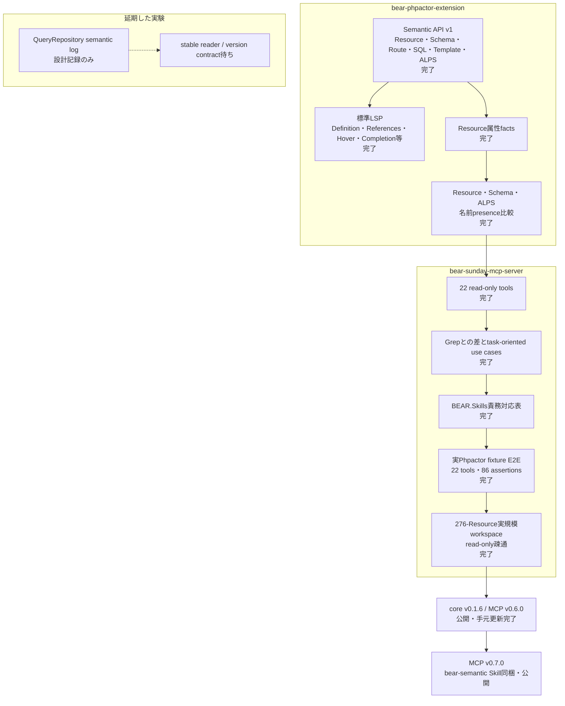

# プロジェクト現在地点

2026-09-18時点の、Phpactor extensionとMCP serverを合わせた実装・検証・公開状況です。

全22 toolの入力と結果は[MCPツール一覧](tools.ja.md)、具体的な調査手順は
[ユースケース](use-cases.ja.md)を参照してください。

## 公開状況

| component | version | 状態 |
|---|---|---|
| `suzumaze/bear-phpactor-extension` | [`v0.1.6`](https://github.com/suzumaze/bear-phpactor-extension/releases/tag/v0.1.6) | GitHub Release・Packagist公開済み |
| `suzumaze/bear-sunday-mcp-server` | [`v0.7.0`](https://github.com/suzumaze/bear-sunday-mcp-server/releases/tag/v0.7.0) | GitHub Release・Packagist公開済み |
| MCP tool inventory | 22 tools | 日本語・英語manual整備済み |
| `bear-semantic` agent Skill | bundled in `v0.7.0` | Codex・Claude Codeで利用可能 |

## Grepから進歩した点

Grepは一致した文字列を返します。Semantic APIは、保存済みsourceから次の意味を解決して返します。

- Resource URIからFQN、path、public method、Link/Embed関係を得る。
- 同じcanonical Resourceを指すstatic referenceとincoming relationを得る。
- Route名、SQL query ID、template名、ALPS descriptorを実体へ解決する。
- allowlist済みResource属性をstatic値とdynamic markerに分ける。
- Resource parameter、JSON Schema、ALPS間の名前presenceを比較する。
- definition、type definition、references、hover、completionなどを標準LSPで補う。

コメント、任意設定、動的式、未対応framework extensionはSemantic Model外です。その部分ではGrepと
source確認を引き続き使います。

## 実環境で確認したこと

初回検証は顧客workspaceの`/private/tmp`一時複製で行いました。release後には、現在の配布版を
元workspaceへread-onlyで接続して再確認しました。どちらの検証でもproject fileは変更せず、
元workspaceのGit状態がcleanであることを確認しました。

| 検査 | 結果 |
|---|---|
| MCP tool inventory | 22 tools |
| release handshake | MCP `0.6.0`、core `v0.1.6`、compatibility issueなし |
| `bear_project_info` | `ok`, Semantic API v1 |
| Resource inventory | 276 Resources |
| bounded list | 20件を返し、再実行結果はbyte-identical |
| describe / attributes / contract | `ok` |
| references / incoming relations | `ok` |
| attribute index | `ok`, total 276, bounded resultは`truncated: true` |
| schema lookup | 選択したResourceでは`not_found`。engine failureではなく意味上の欠落 |

## 現在の境界

- serverはread-onlyで、BEAR applicationや任意PHPを実行しない。
- workspace root、Phpactor command、入力path、result countを固定・制限する。
- runtime cache logは読まず、MCP toolとして公開しない。
- QueryRepository log連携はupstream contractが安定した後に再評価する。
