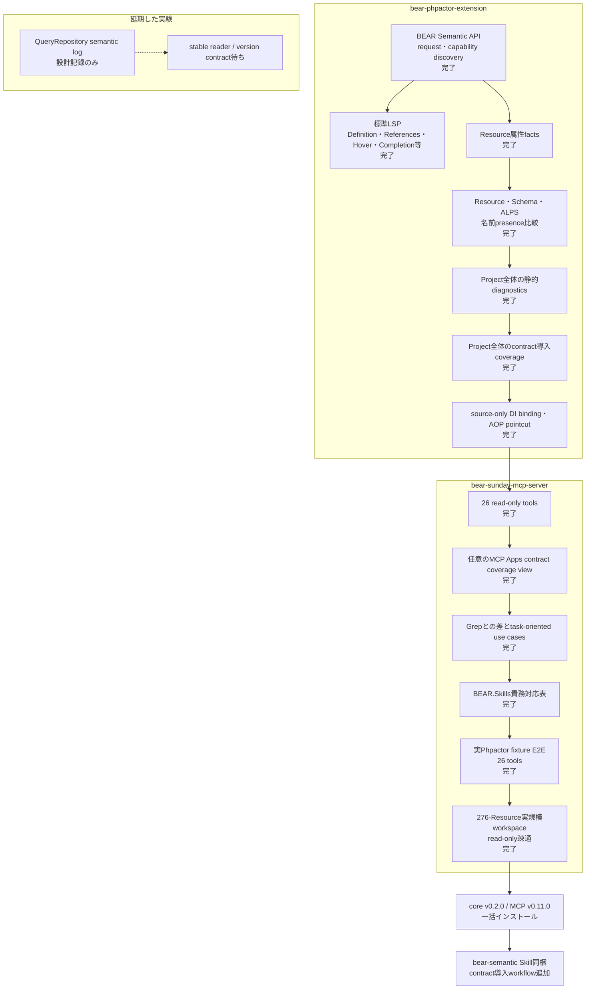

# プロジェクト現在地点

2026-09-24時点の、Phpactor extensionとMCP serverを合わせた実装・検証・公開状況です。

全26 toolの入力と結果は[MCPツール一覧](tools.ja.md)、具体的な調査手順は
[ユースケース](use-cases.ja.md)を参照してください。

## 公開状況

| component | version | 状態 |
|---|---|---|
| `suzumaze/bear-phpactor-extension` | `v0.2.0` | 標準LSP診断、response shape、source-only DI/AOP inventory |
| `suzumaze/bear-sunday-mcp-server` | `v0.11.0` | Phpactor・BEAR拡張v0.2.0を同梱した26 read-only tools |
| MCP tool inventory | `v0.11.0`で26 tools | 日本語・英語manual整備済み |
| Contract coverage UI | 任意のMCP Apps view | read-only、structured/text fallbackを維持 |
| `bear-semantic` agent Skill | `v0.11.0`に同梱 | project、contract導入、DI/AOP宣言workflowを含む |

## Grepから進歩した点

Grepは一致した文字列を返します。Semantic APIは、保存済みsourceから次の意味を解決して返します。

- Resource URIからFQN、path、public method、Link/Embed関係を得る。
- 同じcanonical Resourceを指すstatic referenceとincoming relationを得る。
- Route名、SQL query ID、template名、ALPS descriptorを実体へ解決する。
- allowlist済みResource属性をstatic値とdynamic markerに分ける。
- Resource parameter、JSON Schema、ALPS間の名前presenceを比較する。
- Resource methodごとのJSON Schema・ALPS導入状態と全体集計を得る。
- 直接記述されたRay.Di bindingとRay.Aop interceptor matcher構文木を、runtimeを推測せず得る。
- definition、type definition、references、hover、completionなどを標準LSPで補う。

コメント、任意設定、動的式、未対応framework extensionはSemantic Model外です。その部分ではGrepと
source確認を引き続き使います。

## 実環境で確認したこと

初回検証は顧客workspaceの`/private/tmp`一時複製で行いました。release後には、現在の配布版を
元workspaceへread-onlyで接続して再確認しました。どちらの検証でもproject fileは変更せず、
元workspaceのGit状態がcleanであることを確認しました。

| 検査 | 結果 |
|---|---|
| MCP tool inventory | 22 tools |
| release handshake | MCP `0.6.0`、core `v0.1.6`、compatibility issueなし |
| `bear_project_info` | `ok`、旧version marker `1`（request discoveryへ移行） |
| Resource inventory | 276 Resources |
| bounded list | 20件を返し、再実行結果はbyte-identical |
| describe / attributes / contract | `ok` |
| references / incoming relations | `ok` |
| attribute index | `ok`, total 276, bounded resultは`truncated: true` |
| schema lookup | 選択したResourceでは`not_found`。engine failureではなく意味上の欠落 |

0.8.0 release candidateは、BEAR application、Resource、SQLを実行せずBEAR.Kataに対しても
検証しました。

| 検査 | 結果 |
|---|---|
| MCP tool inventory | 23 tools、`bear_project_diagnostics`を含む |
| release handshake | MCP `0.8.0`、core `v0.1.7`、旧version marker `1` |
| Project diagnostics | `ok`、65 items、result打ち切りなし |
| 走査範囲 | PHP 245 files、41 Resources、Resource走査打ち切りなし |
| skipされた検査 | なし |

既定100件はBeMart（154 Resources、249 methods）の保存済みsourceでの初期実測を参考にしました。
contract coverageは100件で64,480 bytes、200件で128,379 bytes、project diagnosticsは
100件で46,397 bytes、200件で92,981 bytesでした。ただしitemの内容次第でさらに大きくなるため、
両reportに概算56 KiBのitem・provenance budgetを追加し、envelopeとsummaryの余地を残します。
単一itemが非常に大きい場合のwire sizeを厳密に保証するものではありません。diagnosticsは公開済みの
limit 1〜200を維持し、contract coverageは1〜100です。返却件数だけ`offset`を進めます。
以前のBeMart実測では`gapsOnly`は22 adoption gaps、ALPS unresolved 4件すべてを含みました。

## 現在の境界

- serverはread-onlyで、BEAR applicationや任意PHPを実行しない。
- 任意のMCP Apps viewは外部resourceを読み込まず、browser permissionを要求せず、既存のboundedな
  contract coverage resultだけを表示する。
- workspace root、Phpactor command、入力path、result countを固定・制限する。
- runtime cache logは読まず、MCP toolとして公開しない。
- QueryRepository log連携はupstream contractが安定した後に再評価する。
