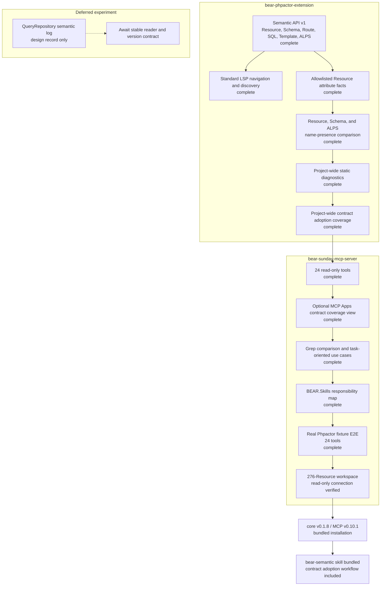

# Project status

This is the combined implementation, verification, and release status of the Phpactor extension
and MCP server as of 2026-09-22.

See the [complete tool inventory](../README.md#tools) ([Japanese](tools.ja.md)) and the
[task-oriented use cases](use-cases.md) ([Japanese](use-cases.ja.md)).

## Release status

| Component | Version | Status |
|---|---|---|
| `suzumaze/bear-phpactor-extension` | `v0.1.8` | Contract coverage Semantic API |
| `suzumaze/bear-sunday-mcp-server` | `v0.10.1` | Bundled Phpactor/BEAR extension, contract coverage, optional view, Feynman-style introduction |
| MCP tool inventory | 24 in `v0.10.1` | English and Japanese manuals complete |
| Contract coverage UI | optional MCP Apps view | Read-only; structured/text fallback retained |
| `bear-semantic` agent skill | bundled with `v0.10.1` | Project diagnostics and contract-adoption workflows included |

## What improved beyond grep

Grep returns matching text. The Semantic API resolves saved-source facts: canonical Resource
identity, methods, Link/Embed relations, references, Route/SQL/template/ALPS targets,
allowlisted attributes, contract-name presence, contract-adoption coverage, and standard LSP navigation.

Comments, arbitrary configuration, dynamic expressions, and unsupported framework
extensions remain outside the semantic model and still require source inspection or search.

## Real-workspace evidence

Initial verification used a temporary copy of the customer workspace under `/private/tmp`.
After release, the installed release binaries were also started against the original workspace
in read-only mode. Neither check modified project files, and the original Git worktree remained
clean.

| Check | Result |
|---|---|
| MCP inventory | 22 tools |
| Release handshake | MCP `0.6.0`, core `v0.1.6`, no compatibility issues |
| Project info | `ok`, Semantic API v1 |
| Resource inventory | 276 Resources |
| Bounded list | 20 returned; repeated result was byte-identical |
| Describe / attributes / contract | `ok` |
| References / incoming relations | `ok` |
| Attribute index | `ok`, total 276, bounded result `truncated: true` |
| Schema lookup | `not_found` for the selected Resource, a semantic absence rather than engine failure |

The 0.8.0 release candidate was also verified against BEAR.Kata without executing the
application, Resources, or SQL:

| Check | Result |
|---|---|
| MCP inventory | 23 tools, including `bear_project_diagnostics` |
| Release handshake | MCP `0.8.0`, core `v0.1.7`, Semantic API v1 |
| Project diagnostics | `ok`, 65 items, no result truncation |
| Scan coverage | 245 PHP files, 41 Resources, no Resource scan truncation |
| Skipped checks | none |

The initial 100-item default was informed by saved-source measurements against BeMart
(154 Resources, 249 methods): contract coverage was 64,480 bytes at 100 items and
128,379 bytes at 200; project diagnostics was 46,397 bytes at 100 and 92,981 bytes at 200.
Other item shapes can be much larger, so both reports also apply an approximate 56 KiB
serialized-item-and-provenance budget, reserving room for the envelope and summary.
This is not a hard wire-size guarantee for a single oversized item. Diagnostics preserves
its published 1–200 input range, while contract coverage accepts 1–100. Advance `offset`
by the returned item count, which may be smaller than the requested `limit`.
In the earlier BeMart measurement, `gapsOnly` returned 22 adoption gaps, including all
four unresolved ALPS declarations.

## Current boundary

- The server is read-only and does not execute the BEAR application or arbitrary PHP.
- The optional MCP Apps view loads no external resources, requests no browser permissions, and
  only presents the existing bounded contract-coverage result.
- Workspace roots, Phpactor commands, input paths, and result counts are fixed or bounded.
- Runtime cache logs are neither read nor exposed as MCP tools.
- QueryRepository log integration will be reconsidered after its upstream contract stabilizes.
