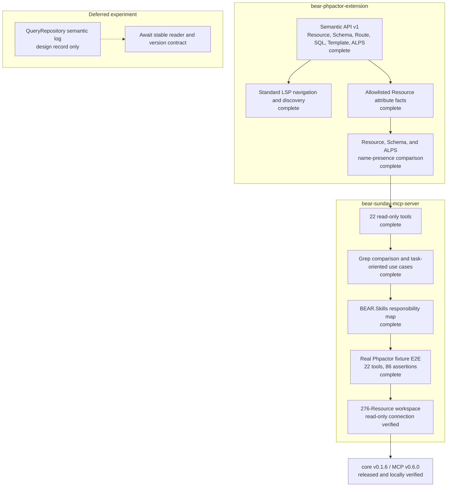

# Project status

This is the combined implementation, verification, and release status of the Phpactor extension
and MCP server as of 2026-09-17.

See the [complete tool inventory](../README.md#tools) ([Japanese](tools.ja.md)) and the
[task-oriented use cases](use-cases.md) ([Japanese](use-cases.ja.md)).

## Release status

| Component | Version | Status |
|---|---|---|
| `suzumaze/bear-phpactor-extension` | [`v0.1.6`](https://github.com/suzumaze/bear-phpactor-extension/releases/tag/v0.1.6) | GitHub Release and Packagist published |
| `suzumaze/bear-sunday-mcp-server` | [`v0.6.0`](https://github.com/suzumaze/bear-sunday-mcp-server/releases/tag/v0.6.0) | GitHub Release and Packagist published |
| MCP tool inventory | 22 tools | English and Japanese manuals complete |

## What improved beyond grep

Grep returns matching text. The Semantic API resolves saved-source facts: canonical Resource
identity, methods, Link/Embed relations, references, Route/SQL/template/ALPS targets,
allowlisted attributes, contract-name presence, and standard LSP navigation.

Comments, arbitrary configuration, dynamic expressions, and unsupported framework
extensions remain outside the semantic model and still require source inspection or search.

## Real-workspace evidence

Initial verification used a temporary copy of the customer workspace under `/private/tmp`.
After release, the installed release binaries were also started against the original workspace
in read-only mode. Neither check modified project files, and the original Git worktree remained
clean.

| Check | Result |
|---|---|
| MCP inventory | 22 tools |
| Release handshake | MCP `0.6.0`, core `v0.1.6`, no compatibility issues |
| Project info | `ok`, Semantic API v1 |
| Resource inventory | 276 Resources |
| Bounded list | 20 returned; repeated result was byte-identical |
| Describe / attributes / contract | `ok` |
| References / incoming relations | `ok` |
| Attribute index | `ok`, total 276, bounded result `truncated: true` |
| Schema lookup | `not_found` for the selected Resource, a semantic absence rather than engine failure |

## Current boundary

- The server is read-only and does not execute the BEAR application or arbitrary PHP.
- Workspace roots, Phpactor commands, input paths, and result counts are fixed or bounded.
- Runtime cache logs are neither read nor exposed as MCP tools.
- QueryRepository log integration will be reconsidered after its upstream contract stabilizes.
